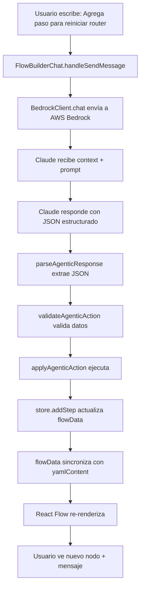

# 📋 Arquitectura del Flow Builder de KIZUKU

## 🏗️ Arquitectura General

Tu aplicación es un **constructor de flujos de trabajo (workflows)** para contact centers que combina:
- **Editor visual interactivo** con React Flow
- **Chat AI agéntico** con AWS Bedrock (Claude)
- **Gestión de estado** con Zustand
- **Persistencia** en localStorage y YAML

---

## 🔄 Flujo Principal: De Chat a Visualización

### 1. Interacción del Usuario con el Chat 
📍 **Archivo**: [`FlowBuilderChat.tsx`](file:///c:/Users/morodriguezm/Desktop/Flow-architect/flow-architect/src/components/FlowBuilderChat.tsx)

```
Usuario escribe mensaje → FlowBuilderChat captura input
│
├─ Crea mensaje de usuario (línea 97-100)
├─ Guarda estado actual para posible undo (línea 106)
└─ Prepara contexto completo para AI
```

### 2. Comunicación con AWS Bedrock
📍 **Archivos**: [`bedrockClient.ts`](file:///c:/Users/morodriguezm/Desktop/Flow-architect/flow-architect/src/lib/bedrock/bedrockClient.ts), [`agenticPrompts.ts`](file:///c:/Users/morodriguezm/Desktop/Flow-architect/flow-architect/src/lib/bedrock/agenticPrompts.ts)

```
BedrockClient envía request (línea 131-134)
│
├─ System Prompt: Instrucciones del agente agéntico
├─ Context Prompt: Estado actual del flujo + análisis
├─ Conversation History: Últimos mensajes
│
└─ Claude responde con JSON estructurado
```

**Ejemplo de respuesta de Claude:**
```json
{
  "analysis": {
    "problems_found": ["Paso huérfano: step_old"],
    "improvements": ["Agregar paso de cierre"],
    "affected_steps": ["step_1", "step_2"]
  },
  "actions": [
    {
      "type": "add_step",
      "data": {
        "step_id": "restart_router",
        "step": { /* FlowStep completo */ }
      },
      "reasoning": "Agregando solución común"
    }
  ],
  "message": "✅ He agregado el paso...",
  "suggestions": ["Verificar después", "Conectar con diagnósticos"]
}
```

### 3. Parseo y Validación
📍 **Archivo**: [`agenticFlowParser.ts`](file:///c:/Users/morodriguezm/Desktop/Flow-architect/flow-architect/src/lib/bedrock/agenticFlowParser.ts)

```
parseAgenticResponse() extrae JSON (línea 39-78)
│
├─ Busca ```json o bloques JSON
├─ Valida estructura mínima
└─ Retorna ParsedAgenticResponse
```

### 4. Aplicación de Acciones
📍 **Archivo**: [`FlowBuilderChat.tsx:L144-L175`](file:///c:/Users/morodriguezm/Desktop/Flow-architect/flow-architect/src/components/FlowBuilderChat.tsx#L144-L175)

```
Para cada acción en parsed.actions:
│
├─ validateAgenticAction() → Valida datos
├─ applyAgenticAction() → Ejecuta
│   │
│   └─ Llama a métodos del store:
│       ├─ addStep()
│       ├─ updateStep()
│       ├─ deleteStep()
│       ├─ updateMetadata()
│       └─ setConstant()
│
└─ Rastrea pasos creados/modificados
```

### 5. Actualización del Estado Global
📍 **Archivo**: [`flowStore.ts`](file:///c:/Users/morodriguezm/Desktop/Flow-architect/flow-architect/src/store/flowStore.ts)

```
useFlowStore (Zustand) gestiona:
│
├─ flowData (FlowData) ← FUENTE DE VERDAD
│   ├─ flow_id, name, version
│   ├─ steps: Record<string, FlowStep>
│   ├─ constants
│   └─ metadata
│
├─ yamlContent ← Generado automáticamente desde flowData
│
├─ persistentChatMessages ← Historial de chat (localStorage)
│
└─ agentContext
    ├─ lastModifications
    └─ flowHistory (para undo, últimas 10 versiones)
```

**Sincronización automática:**
```typescript
addStep: (step) => {
  const newSteps = { ...flowData.steps, [step.step_id]: step };
  const newFlowData = { ...flowData, steps: newSteps };
  set({ 
    flowData: newFlowData, 
    yamlContent: flowDataToYaml(newFlowData) // Auto-sync
  });
}
```

### 6. Renderizado Visual
📍 **Componente visualizador** (React Flow)

```
flowData.steps → Convertidos a nodos y edges
│
├─ Nodos: Cada FlowStep
│   ├─ Posición calculada automáticamente
│   ├─ Tipo visual según step.type
│   └─ Animaciones (Framer Motion)
│
└─ Edges: Conexiones entre pasos
    ├─ next_step
    ├─ config.options[].next_step
    └─ config.conditions[].next_step
```

---

## 🧠 Capacidades Agénticas Clave

### Análisis Automático
📍 [`agenticFlowParser.ts`](file:///c:/Users/morodriguezm/Desktop/Flow-architect/flow-architect/src/lib/bedrock/agenticFlowParser.ts) → `analyzeFlow()`

```typescript
analyzeFlow(flowData) detecta:
├─ Pasos huérfanos (no conectados)
├─ Conexiones rotas (apuntan a pasos inexistentes)
├─ Pasos terminales (sin next_step)
└─ Sugerencias de mejora
```

### Memoria Persistente
- **Chat completo** guardado en `localStorage`
- **Contexto enviado a Claude** incluye:
  - Metadatos del flujo
  - Todos los pasos (primeros 10)
  - Análisis de problemas
  - Últimos 4 mensajes de conversación
  - Constantes

### Tipos de Acciones Soportadas

| Acción | Descripción | Ejemplo de Uso |
|--------|-------------|----------------|
| `add_step` | Agregar un paso | "Agrega paso para reiniciar router" |
| `add_multiple_steps` | Agregar varios pasos a la vez | "Crea flujo de diagnóstico WiFi completo" |
| `modify_step` | Modificar paso existente | "Cambia el timeout a 60 segundos" |
| `delete_step` | Eliminar paso | "Borra el paso de verificación antigua" |
| `modify_connections` | Cambiar conexiones | "Todos los diagnósticos deben ir al reinicio" |
| `fix_orphans` | Reparar pasos huérfanos | "Repara pasos desconectados" |
| `update_metadata` | Cambiar nombre/versión | "Cambia el nombre del flujo" |
| `modify_constants` | Actualizar constantes | "Sube el umbral de RSSI a -60" |

---

## 📊 Tipos de Pasos en los Flujos

### 1. `collect_information`
Recopilar datos del usuario (nombre, RSSI, etc.)

**Ejemplo:**
```typescript
{
  step_id: "get_customer_name",
  name: "Obtener Nombre",
  type: "collect_information",
  config: {
    prompt: "Por favor, solicita el nombre completo del cliente",
    field_name: "customer_name",
    validation: { type: "text" }
  },
  next_step: "siguiente_paso"
}
```

### 2. `decision_point`
Presentar opciones al usuario (WiFi/Ethernet, Sí/No)

**Ejemplo:**
```typescript
{
  step_id: "connection_type",
  name: "Tipo de Conexión",
  type: "decision_point",
  config: {
    prompt: "¿Qué tipo de conexión tienes?",
    options: [
      { label: "WiFi", value: "wifi", next_step: "check_wifi" },
      { label: "Ethernet", value: "ethernet", next_step: "check_cable" }
    ]
  }
}
```

### 3. `evaluate_condition`
Evaluar condiciones automáticamente (if RSSI < -65)

**Ejemplo:**
```typescript
{
  step_id: "check_signal",
  name: "Evaluar Señal",
  type: "evaluate_condition",
  config: {
    conditions: [
      {
        field: "rssi_value",
        operator: "<",
        value: -65,
        next_step: "offer_upgrade"
      }
    ],
    default_next_step: "continue_diagnosis"
  }
}
```

### 4. `provide_instructions`
Dar instrucciones al agente (reiniciar router)

**Ejemplo:**
```typescript
{
  step_id: "restart_modem",
  name: "Reiniciar Modem",
  type: "provide_instructions",
  config: {
    instructions_text: "Solicita al cliente desconectar el modem 30s...",
    confirmation_required: true
  },
  next_step: "verify_connection"
}
```

### 5. `execute_action`
Ejecutar acción (cerrar caso, crear ticket)

**Ejemplo:**
```typescript
{
  step_id: "create_ticket",
  name: "Crear Ticket",
  type: "execute_action",
  config: {
    action_type: "create_ticket",
    action_params: { priority: "high" }
  },
  next_step: "escalate"
}
```

---

## 🔁 Ejemplo de Flujo Completo



### Paso a Paso Detallado:

1. **Usuario**: "Agrega un paso para reiniciar el router"

2. **FlowBuilderChat.handleSendMessage()**
   - Guarda mensaje del usuario
   - Guarda snapshot actual para undo

3. **BedrockClient.chat()** → AWS Bedrock
   - System Prompt: "Eres un asistente agéntico..."
   - Context: Estado actual del flujo + análisis
   - User Message: "Agrega un paso para reiniciar el router"

4. **Claude responde:**
   ```json
   {
     "actions": [{
       "type": "add_step",
       "data": {
         "step_id": "restart_router",
         "step": {
           "step_id": "restart_router",
           "name": "Reiniciar Router",
           "type": "provide_instructions",
           "config": {
             "instructions_text": "Desconectar router 30s..."
           }
         }
       }
     }],
     "message": "✅ He agregado el paso..."
   }
   ```

5. **parseAgenticResponse()** → Extrae JSON

6. **applyAgenticAction()** → `store.addStep()`

7. **flowStore actualiza:**
   - `flowData.steps["restart_router"]` = nuevo paso
   - `yamlContent = yaml.dump(flowData)`

8. **React Flow re-renderiza** → Nuevo nodo visible

9. **Toast de éxito** + Mensaje del AI en chat

---

## 🎯 Puntos Clave de Diseño

### Principios Arquitecturales

1. **Un solo source of truth**: `flowData` en Zustand
2. **YAML es derivado**: Siempre sincronizado con `flowData`
3. **Chat persistente**: Memoria completa en localStorage
4. **Contexto completo**: Claude siempre ve el estado actual
5. **Undo/Redo**: Historial de 10 versiones anteriores
6. **Validación**: Todas las acciones validadas antes de aplicar
7. **Análisis proactivo**: Detecta problemas automáticamente

### Estructura de Datos Principal

```typescript
interface FlowData {
  flow_id: string;
  name: string;
  version: string;
  description?: string;
  initial_step?: string;
  constants?: Record<string, string | number | boolean>;
  steps: Record<string, FlowStep>;
  registration_templates?: Record<string, string>;
  escalation_rules?: Record<string, unknown>;
  metadata?: Record<string, unknown>;
}

interface FlowStep {
  step_id: string;
  name: string;
  type: StepType;
  config: StepConfig;
  next_step?: string;
}
```

### Sincronización Bidireccional

```
flowData (JavaScript) ⟷ yamlContent (YAML string)
        │
        └── Automática en cada cambio
            ├── addStep() → flowDataToYaml()
            ├── updateStep() → flowDataToYaml()
            ├── deleteStep() → flowDataToYaml()
            └── setYamlContent() → yamlToFlowData()
```

---

## 🔧 Archivos Principales

| Archivo | Responsabilidad |
|---------|----------------|
| [`FlowBuilderChat.tsx`](file:///c:/Users/morodriguezm/Desktop/Flow-architect/flow-architect/src/components/FlowBuilderChat.tsx) | UI del chat, orquestación de mensajes |
| [`flowStore.ts`](file:///c:/Users/morodriguezm/Desktop/Flow-architect/flow-architect/src/store/flowStore.ts) | Estado global, gestión de pasos y YAML |
| [`agenticFlowParser.ts`](file:///c:/Users/morodriguezm/Desktop/Flow-architect/flow-architect/src/lib/bedrock/agenticFlowParser.ts) | Parseo, validación y aplicación de acciones |
| [`agenticPrompts.ts`](file:///c:/Users/morodriguezm/Desktop/Flow-architect/flow-architect/src/lib/bedrock/agenticPrompts.ts) | Generación de prompts contextualizados |
| [`bedrockClient.ts`](file:///c:/Users/morodriguezm/Desktop/Flow-architect/flow-architect/src/lib/bedrock/bedrockClient.ts) | Cliente AWS Bedrock |

---

## 🚀 Características Avanzadas

### Sistema de Animaciones
- Animaciones secuenciales para nodos
- Efectos de escala, fade, bounce
- Animación de edges (líneas dibujándose)
- Configuración de velocidad por usuario

### Análisis Inteligente
- Detección de pasos huérfanos
- Identificación de conexiones rotas
- Sugerencias de optimización
- Análisis de flujos circulares

### Memoria Contextual
- Historial completo de conversación
- Contexto de modificaciones recientes
- Análisis automático en cada turno
- Sugerencias inteligentes basadas en estado

---

## 📝 Notas de Implementación

### Persistencia
- **Chat**: `localStorage` con clave `agentic_chat_history`
- **Flow History**: En memoria (Zustand), últimas 10 versiones
- **Configuración**: `animationEnabled`, `animationSpeed` en localStorage

### Performance
- Máximo 50 mensajes de chat en memoria
- Primeros 10 pasos mostrados en contexto
- Análisis ejecutado bajo demanda

### Seguridad
- Credenciales AWS nunca expuestas al frontend (solo en Zustand)
- Validación de todas las acciones antes de aplicar
- YAML parseado con `js-yaml` (safe mode)

---

*Última actualización: 2026-02-06*
